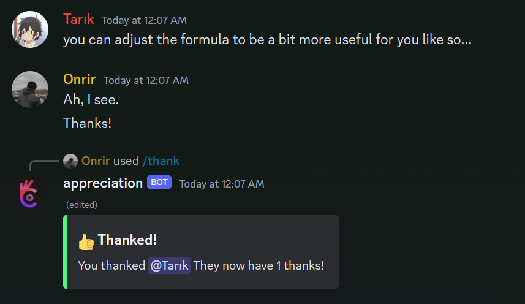

# Appreciation-bot

Free and open source Discord bot made to show appreciation to others and reward said appreciation. Beutifully translated to 3 languages.

[Add to your server](https://discord.com/api/oauth2/authorize?client_id=1196863040029732884&permissions=275146729472&scope=bot+applications.commands), [Build Instructions](#build)

## Check out other languages

- [Turkish Docs ](./assets/TR.md)
- [English Docs ]()
- [Japanese Docs](./assets/JA.md) 
- Korean Docs  (Coming soon)

## Features

- [x] Language support for English, Turkish, Japanese
- [ ] Language support for Korean, German and Spanish
- [x] Customisable role rewards
- [x] Admin commands (`/set`, `/set-cooldown`)
- [x] Customisable cooldowns

## Table of Contents

- [Appreciation-bot](#appreciation-bot)
  - [Check out other languages](#check-out-other-languages)
  - [Features](#features)
  - [Table of Contents](#table-of-contents)
  - [Commands](#commands)
    - [`/thank <@user>`](#thank-user)
    - [`/info <@user>?`](#info-user)
    - [`/rewards`](#rewards)
    - [`/set-thanks <@user> <amount>`](#set-thanks-user-amount)
    - [`/set-cooldown <amount>`](#set-cooldown-amount)
    - [`/add-role-reward <amount> <@role>`](#add-role-reward-amount-role)
    - [`/remove-role-reward <amount>`](#remove-role-reward-amount)
  - [Build](#build)
  - [License](#license)

## Commands

### `/thank <@user>`

thanks the given user, adds **1** point to their score and gives them a role if role rewards are set and they have enough points.

Shows the cooldown if the user is on cooldown.

### `/info <@user>?`

Shows the score of the given user, if no user is given, shows the score of the user who sent the command.

### `/rewards`

Shows the role rewards set for the server.

### `/set-thanks <@user> <amount>`

Sets the score of the given user to the given amount.

### `/set-cooldown <amount>`

Sets the cooldown of the server to the given amount.

### `/add-role-reward <amount> <@role>`

Adds a role reward to the server, if the role reward already exists, adds the given amount to the existing amount.

### `/remove-role-reward <amount>`

Removes the given role reward from the server.

## Build

1. Clone the repository
2. Install dependencies with `npm install`
3. Add your token to the `config` file
4. Run the bot with `npm start`
5. Invite the bot to your server and enjoy!

## License

This project is licensed under the MIT License - see the [LICENSE](LICENSE) file for details