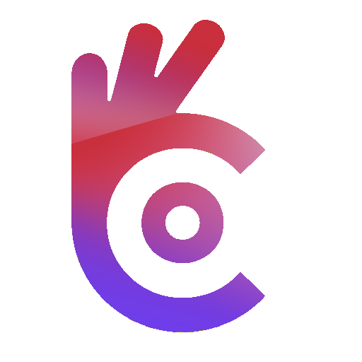
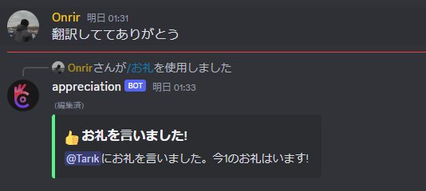

# Appreciation-bot

人にお礼を言うのため作られたオープンソース、無料なDiscordボット

[ギルドに入る込み](https://discord.com/api/oauth2/authorize?client_id=1196863040029732884&permissions=275146729472&scope=bot+applications.commands), [申請中](#build)

## 他の語

- [トルコ語 ]()
- [英語 ](../README.md)
- [日本語]() 
- 韓国語  (近日公開)

## 特徴

- [x] トルコ語、英語と日本語サポート
- [ ] 韓国語、ドイツ語とスペイン語サポート
- [x] 設定されるロール報酬
- [x] 設定される冷却期間
- [x] 管理者コマンド (`/お礼の設定`とか`/冷却期間の設定`とか)
- [x] 完全にオープンソースと無料

## 内容

- [Appreciation-bot](#appreciation-bot)
  - [他の語](#他の語)
  - [特徴](#特徴)
  - [内容](#内容)
  - [Komutlar](#komutlar)
    - [`/teşekkür-et <@user>`](#teşekkür-et-user)
    - [`/bilgi <@user>?`](#bilgi-user)
    - [`/ödüller`](#ödüller)
    - [`/teşekkür-ayarla <@user> <amount>`](#teşekkür-ayarla-user-amount)
    - [`/bekleme-süresini-ayarla <amount>`](#bekleme-süresini-ayarla-amount)
    - [`/rol-ödülü-ekle <amount> <@role>`](#rol-ödülü-ekle-amount-role)
    - [`/rol-ödülü-kaldır <amount>`](#rol-ödülü-kaldır-amount)
  - [Build Adımları](#build-adımları)
  - [Lisans](#lisans)

## コマンド

### `/お礼 <@ユーザー>`

設定された人にお礼を言う、お礼を言った人のポイントを上げる。もしユーザーが設定されませんと、コマンドを使う人のポイントを上げる。

### `/革命 <@ユーザー>?`

設定された人のポイントを見せる。もし人は設定されませんと、使う人のポイントを見せる。

### `/報酬`

ギルドの報酬ロールを見せる。

### `/お礼の設定 <@ユーザー> <数>`

設定された人のポイントを設定された数に設定される。もし人は設定されませんと、使う人のポイントを変わる。

### `/冷却期間の設定 <時>`

お礼の冷却期間をの設定されます。

### `/ロール報酬を追加 <数> <@ロール>`

ギルドにロール報酬を追加します。

### `/ロール報酬を消す <数>`

ギルドからロール報酬を消します。

## ビルド一歩

1. レポをクロンす
2. 依存を`npm install`インストールする
3. `config`ファイルにトークンを追加します
4. `npm start`でボートを起きる
5. ボートをギルドに招待して楽しんで！

## Lisans

このプロジェクトはMIT免許証で免許証されます。もっと除法に[免許証](../LICENSE)で見つかります。